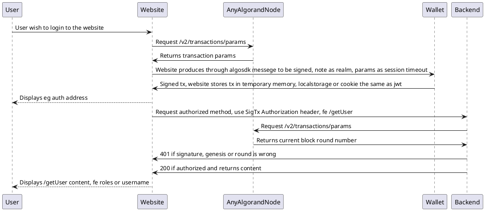

# Algorand Standard for authentication implementation in .net

ARC-0014 implementation in .net

https://github.com/algorandfoundation/ARCs/issues/42

## Usage

StartUp.cs
```c#
public void ConfigureServices(
	IServiceCollection services)
{

...

	var algorandAuthenticationOptions = new AlgorandAuthenticationOptions();
	builder.Configuration.GetSection("AlgorandAuthentication").Bind(algorandAuthenticationOptions);

	builder.Services
	 .AddAuthentication(AlgorandAuthenticationHandler.ID)
	 .AddAlgorand(o =>
	 {
		 o.CheckExpiration = algorandAuthenticationOptions.CheckExpiration;
		 o.Debug = algorandAuthenticationOptions.Debug;
		 o.AlgodServer = algorandAuthenticationOptions.AlgodServer;
		 o.AlgodServerToken = algorandAuthenticationOptions.AlgodServerToken;
		 o.AlgodServerHeader = algorandAuthenticationOptions.AlgodServerHeader;
		 o.Realm = algorandAuthenticationOptions.Realm;
		 o.NetworkGenesisHash = algorandAuthenticationOptions.NetworkGenesisHash;
		 o.MsPerBlock = algorandAuthenticationOptions.MsPerBlock;
		 o.EmptySuccessOnFailure = algorandAuthenticationOptions.EmptySuccessOnFailure;
		 o.EmptySuccessOnFailure = algorandAuthenticationOptions.EmptySuccessOnFailure;
	 });

...

}

public void Configure(
	IApplicationBuilder app
	)
{

...

  app.UseAuthentication();
  app.UseAuthorization();

...

}
```

appsettings.json
```json
{
  "AlgorandAuthentication": {
    "AlgodServer": "https://testnet-api.algonode.cloud",
    "AlgodServerToken": "aaaaaaaaaaaaaaaaaaaaaaaaaaaaaaaaaaaaaaaaaaaaaaaaaaaaaaaaaaaaaaaa",
    "NetworkGenesisHash": "SGO1GKSzyE7IEPItTxCByw9x8FmnrCDexi9/cOUJOiI=",
    "AlgodServerHeader": "X-Algo-API-Token",
    "Realm": "2FA#ARC14",
    "CheckExpiration": "true",
    "Debug": "true"
  }
}
```

Controller/Example.cs
```
        [Authorize]
        [HttpPost("Create")]
        public async Task<ActionResult<bool>> Create()
        {
        ...
        }
```

## Activity diagram

Plantuml:




## Example use

### Algorand KMD Node

Algorand KMD Node is proxy to algorand participation node which allow to create participation keys. It uses ARC-0014 authentication to ensure no spam traffic to cpu sensitive methods.

https://github.com/scholtz/AlgorandKMDServer/blob/f9d04b717f0f58cf9151bd8fa9a65b7e805db87c/Program.cs#L48

### Hasura Algorand Auth Web Hook

GraphQL algorand authentication for live websocket authenticated feeds.

https://github.com/scholtz/HasuraAlgorandAuthWebHook

### Algorand 2FA Multisig

Project aims to create multisig account from hot wallet account, 2fa authentication account and cold storage account.

https://github.com/scholtz/Algorand2FAMultisig