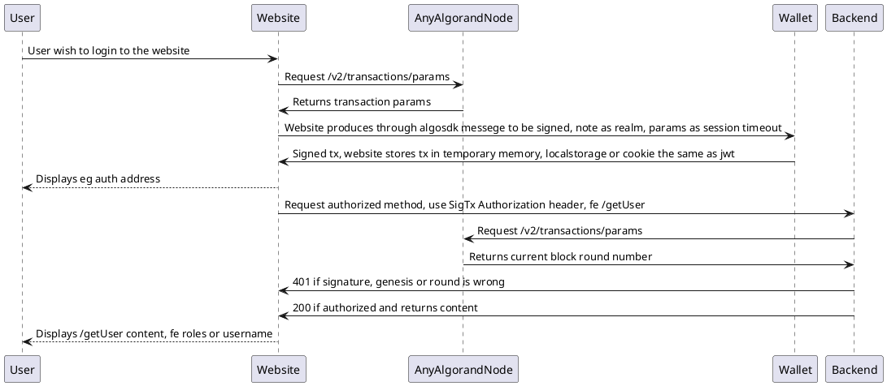

# Algorand Standard for authentication implementation in .net

ARC-0014 implementation in .net

https://github.com/algorandfoundation/ARCs/issues/42

## Usage

### Install nuget

```
dotnet add package AlgorandAuthentication --version 2.0.3
```

### StartUp.cs

```c#
public void ConfigureServices(
	IServiceCollection services)
{

...

            var authOptions = builder.Configuration.GetSection("AlgorandAuthentication").Get<AlgorandAuthenticationOptionsV2>();
            if (authOptions == null) throw new Exception("Config for the authentication is missing");
            builder.Services.AddAuthentication(AlgorandAuthenticationHandlerV2.ID).AddAlgorand(a =>
            {
                a.Realm = authOptions.Realm;
                a.CheckExpiration = authOptions.CheckExpiration;
                a.EmptySuccessOnFailure = authOptions.EmptySuccessOnFailure;
                a.AllowedNetworks = authOptions.AllowedNetworks;
                a.Debug = authOptions.Debug;
            });


...

}

public void Configure(
	IApplicationBuilder app
	)
{

...

  app.UseAuthentication();
  app.UseAuthorization();

...

}
```

### appsettings.json

```json
{
  "AlgorandAuthentication": {
    "Realm": "MyProject#ARC14",
    "CheckExpiration": true,
    "AllowEmptyAccounts": false,
    "Debug": false,
    "AllowedNetworks": {
      "SGO1GKSzyE7IEPItTxCByw9x8FmnrCDexi9/cOUJOiI=": {
        "Server": "https://testnet-api.4160.nodely.dev",
        "Token": "",
        "Header": ""
      }
    }
  }
}
```

```json
{
  "AlgorandAuthentication": {
    "Realm": "MyProject#ARC14",
    "CheckExpiration": true,
    "AllowEmptyAccounts": false,
    "Debug": false,
    "AllowedNetworks": {
      "SGO1GKSzyE7IEPItTxCByw9x8FmnrCDexi9/cOUJOiI=": {
        "Server": "https://testnet-api.4160.nodely.dev",
        "Token": "",
        "Header": ""
      },
      "wGHE2Pwdvd7S12BL5FaOP20EGYesN73ktiC1qzkkit8=": {
        "Server": "https://mainnet-api.4160.nodely.dev",
        "Token": "",
        "Header": ""
      },
      "r20fSQI8gWe/kFZziNonSPCXLwcQmH/nxROvnnueWOk=": {
        "Server": "https://mainnet-api.voi.nodely.dev",
        "Token": "",
        "Header": ""
      },
      "PgeQVJJgx/LYKJfIEz7dbfNPuXmDyJ+O7FwQ4XL9tE8=": {
        "Server": "https://algod.aramidmain.a-wallet.net",
        "Token": "",
        "Header": ""
      }
    }
  }
}
```

Controller/Example.cs
```
        [Authorize]
        [HttpPost("Create")]
        public async Task<ActionResult<bool>> Create()
        {
        ...
        }
```

## Activity diagram

Plantuml:




## Example use

### Algorand KMD Node

Algorand KMD Node is proxy to algorand participation node which allow to create participation keys. It uses ARC-0014 authentication to ensure no spam traffic to cpu sensitive methods.

https://github.com/scholtz/AlgorandKMDServer/blob/f9d04b717f0f58cf9151bd8fa9a65b7e805db87c/Program.cs#L48

### Hasura Algorand Auth Web Hook

GraphQL algorand authentication for live websocket authenticated feeds.

https://github.com/scholtz/HasuraAlgorandAuthWebHook

### Algorand 2FA Multisig

Project aims to create multisig account from hot wallet account, 2fa authentication account and cold storage account.

https://github.com/scholtz/Algorand2FAMultisig


## Migration guide from V1 to V2

### Convert appsettings.json

```
{
  "AlgorandAuthentication": {
    "AlgodServer": "https://testnet-api.algonode.cloud",
    "AlgodServerToken": "aaaaaaaaaaaaaaaaaaaaaaaaaaaaaaaaaaaaaaaaaaaaaaaaaaaaaaaaaaaaaaaa",
    "NetworkGenesisHash": "SGO1GKSzyE7IEPItTxCByw9x8FmnrCDexi9/cOUJOiI=",
    "AlgodServerHeader": "X-Algo-API-Token",
    "Realm": "2FA#ARC14",
    "CheckExpiration": "true",
    "Debug": "true"
  }
}
```
to
```
{
  "AlgorandAuthentication": {
    "Realm": "MyProject#ARC14",
    "CheckExpiration": true,
    "AllowEmptyAccounts": false,
    "Debug": false,
    "AllowedNetworks": {
      "SGO1GKSzyE7IEPItTxCByw9x8FmnrCDexi9/cOUJOiI=": {
        "Server": "https://testnet-api.4160.nodely.dev",
        "Token": "",
        "Header": ""
      }
    }
  }
}
```

in startup.cs or program.cs use

```
            var authOptions = builder.Configuration.GetSection("AlgorandAuthentication").Get<AlgorandAuthenticationOptionsV2>();
            if (authOptions == null) throw new Exception("Config for the authentication is missing");
            builder.Services.AddAuthentication(AlgorandAuthenticationHandlerV2.ID).AddAlgorand(a =>
            {
                a.Realm = authOptions.Realm;
                a.CheckExpiration = authOptions.CheckExpiration;
                a.AllowEmptyAccounts = authOptions.AllowEmptyAccounts;
                a.EmptySuccessOnFailure = authOptions.EmptySuccessOnFailure;
                a.AllowedNetworks = authOptions.AllowedNetworks;
                a.Debug = authOptions.Debug;
            });

```
